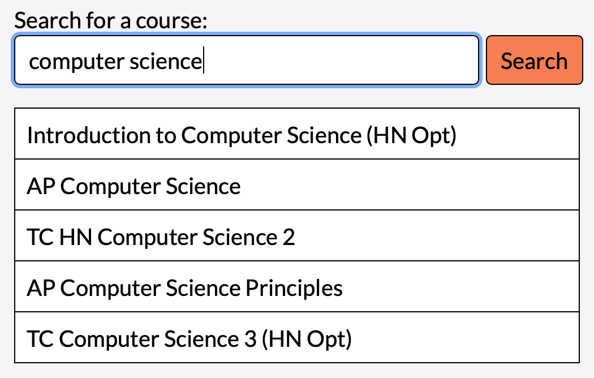
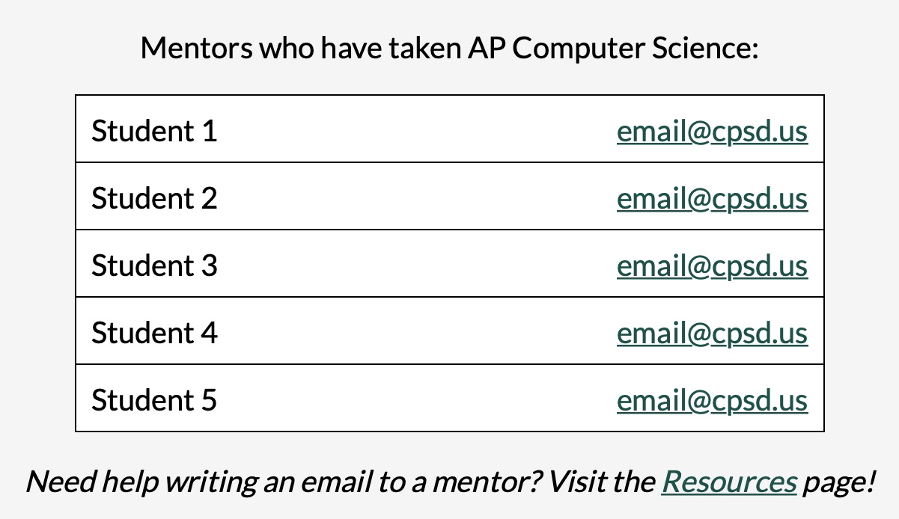
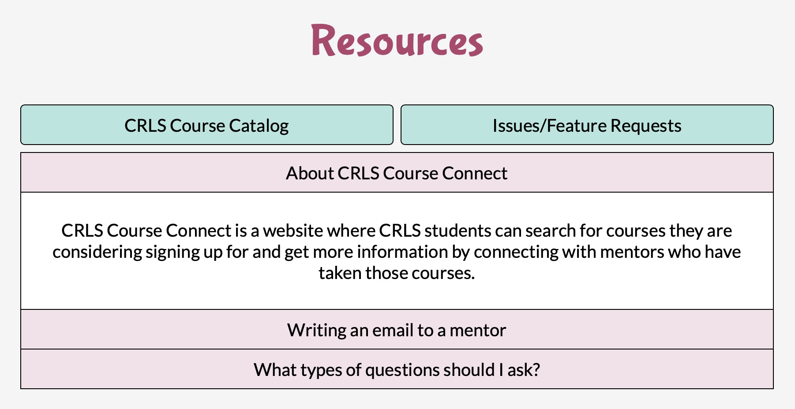

# CRLS Course Connect
CRLS Course Connect is a website where CRLS students can search for courses they are considering signing up for and get more information by connecting with student mentors who have taken those courses.

To use CRLS Course Connect, visit <https://courseconnect.cpsd.us> and log in using your CPSD Google account.

## Features
Start by searching for courses from the [CRLS Course Catalog](https://secure1.cpsd.us/course_catalog/).  


Click on a course to get a list of student mentors who have taken that course. Using your CPSD email, send an email to any of these mentors to ask about the course's workload, types of assignments, etc.  


Visit the Resources page to get more information about how to use CRLS Course Connect, tips on writing emails to mentors, and more.  


## Locally Running CRLS Course Connect
To run CRLS Course Connect on your own device, follow the instructions below.

### Clone the Repository
To contribute to CRLS Course Connect, fork this repository and clone the fork using [git](https://git-scm.com).

To run CRLS Course Connect without tracking changes to the codebase, download the code using the green "Code" button. You should then be able to extract a ZIP file with a folder containing the code.

### Install Node.js
The backend of CRLS Course Connect is written in Node, so make sure [Node.js](https://nodejs.org), including `npm`, is installed.

In the `course-connect` directory, run `npm install` to install the necessary dependencies.

### MySQL Database
CRLS Course Connect uses a MySQL database to store the lists of courses and mentors. To set up the database on your own device, start by [installing MySQL](https://dev.mysql.com/downloads/mysql/). Make sure to install the `x86` version, and follow the installation instructions for your respective operating system. 

When prompted, select "Use Strong Password Encryption," and when asked to enter a password for the root user, create a password. You will use this password to connect to the database, so do not lose it.

To connect to the database, create a file called `.env` in your main directory. The purpose of this file is to store the information required to connect to your database without it being tracked by Git. Paste the following into your `.env` file, and add your password in the appropriate space:

```
DB_HOST=localhost
DB_USER=root
DB_PASSWORD=
DB_NAME=courseconnect
```

### Setup
Navigate to `setup/test-data` and create a file called `codes.tsv`. This is where you will store the single-use authentication codes needed to access the form where mentors input the courses they have taken. If you do not need to access the mentor form, leave this file blank. Otherwise, either copy and paste the sample codes from `sample-codes.tsv` into `codes.tsv`, or directly enter your own authentication codes into `codes.tsv`.

To set up the database and add the course data and authentication codes, run `mysql -u root -p < setup/setup.sql` in the `course-connect` directory. Enter the password to your database when prompted.

To add test data to your database, run `mysql -u root -p < setup/fill.sql` in the `course-connect` directory. Enter the password to your database when prompted.

### Starting the Server
To start the CRLS Course Connect server, run `npm start` in the `course-connect` directory of your terminal. Visit `localhost:3000` in your browser. To access the mentor form, visit `localhost:3000/form`.

### Issues/Feature Requests
If you come across any issues while using the site or have any ideas for new features, please open an [issue](https://github.com/jadebuckwalter/course-connect/issues) on GitHub or fill out this [form](https://forms.gle/p7t2yP6AsWCRrYu39).
